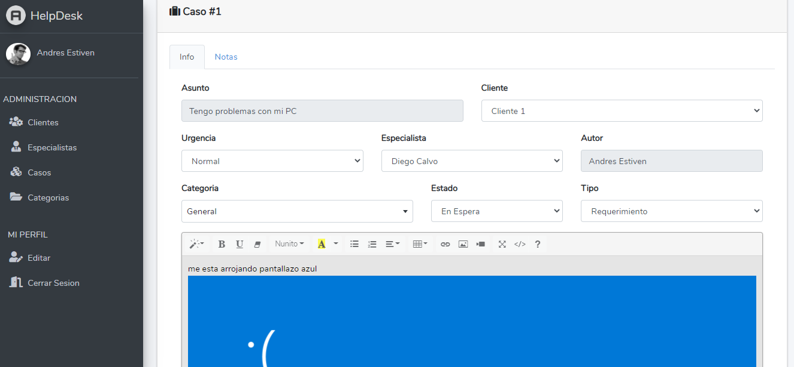
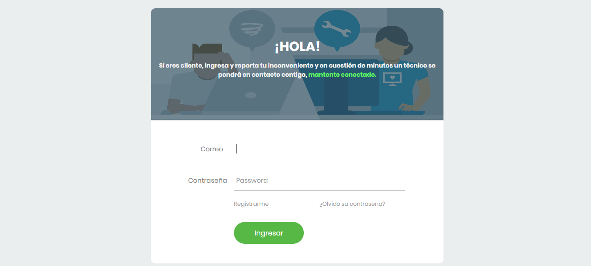
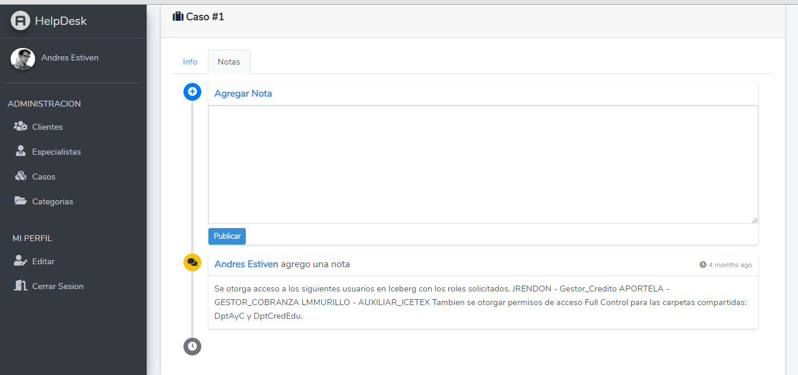
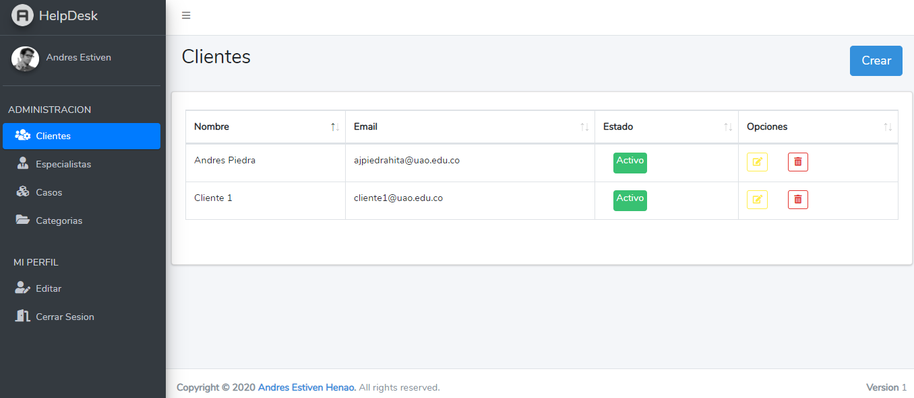
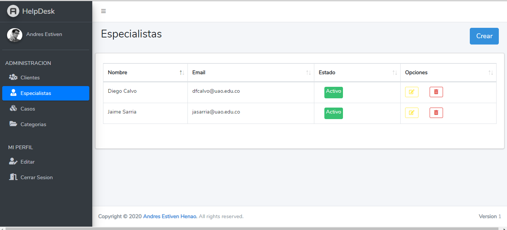
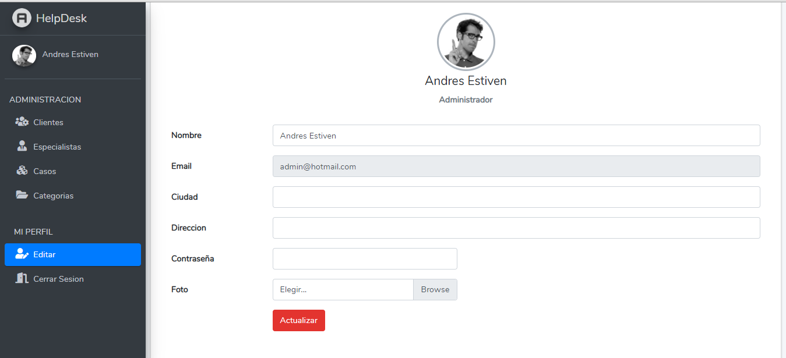

<h1> HelpDesk App Web</h1>

## Acerca de la App Web

El desarrollo de esta Aplicacion Web es algo que quice hacer en mi tiempo libre, aunque aun me falta mucho que implementar, la app cuenta con funcionalidades como lo son:
- Inicio de Sesíon
- Creacion de caso
- Diferente vistas para administradores y auxiliares
- Priveligios de acceso en la App
- 4 estados del caso, registrado, en proceso, en espera y cerrado
- Opcion para agregar notas o avances del caso.

## Instalacion

Simplemente deben clonar el repositorio y ejecutar las migraciones de la BD.

## Capturas de Pantalla

## License GNU GPLv3

Los permisos de esta sólida licencia de copyleft están condicionados a poner a disposición el código fuente completo de obras con licencia y modificaciones, que incluyen obras más grandes que utilizan una obra con licencia, bajo la misma licencia. Los avisos de copyright y licencia deben conservarse. Los contribuyentes otorgan una concesión expresa de derechos de patente.
